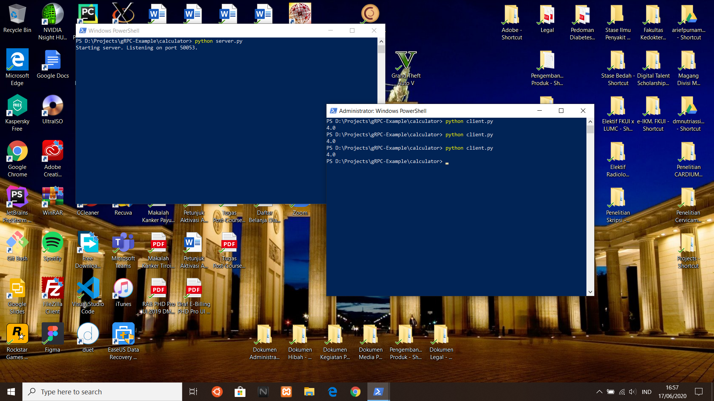

# Calculator
Example calculator project using gRPC.

## Step-by-Step Summary
- Define the function
- Set up protocol buffers
- Generate gRPC classes for Python
- Create a gRPC server
- Create a gRPC client

## Screenshots

## Notes
The file generated by `python -m grpc_tools.protoc -I. --python_out=. --grpc_python_out=. calculator.proto` is as follows:
- **calculator_pb2.py - contains message classes** 
  - **calculator_pb2.Number** for request/response variables (x and y)
- **calculator_pb2_grpc_.py - contains server and client classes** 
  - **calculator_pb2_grpc.CalculatorServicer** for the server
  - **calculator_pb2_grpc.CalculatorStub** for the client

## References
- https://www.semantics3.com/blog/a-simplified-guide-to-grpc-in-python-6c4e25f0c506/